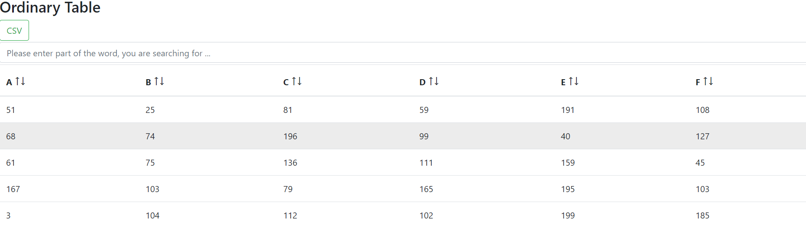
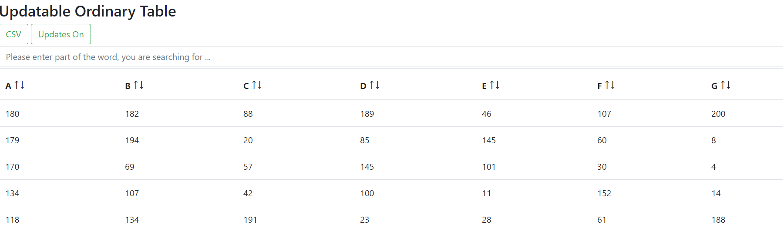
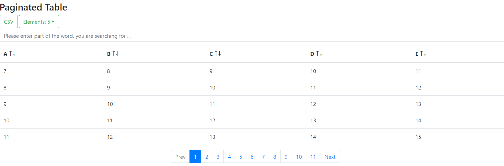
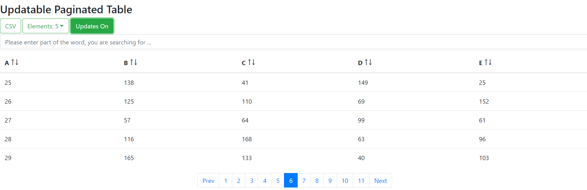

# js6tables

js6tables is the collection of JavaScript ECMA 6 tables with easy to customize style, the tables have the majority
of desired features like pagination, sortable columns, searchbox, download table in csv format option, rows per page
selector, periodic updates of table data.

js6tables is the choice for you if you would like to have out of the box solution with customizable style,
but also want to have opportunity to add your own features to existent code working with modern JavasScript
version ECMA6.

The project is inspired by Google Charts library and DataTables. The repo contains complete example how to use
js6tables with Python Flask Backend.

**Four Table Types To Choose: BasicTable, BasicUpdTable, PagedTable, PagedUpdTable**

**BasicTable**

**BasicUpdTable**

**PagedTable**

**PagedUpdTable**

**Features:**

1. Really reusable OOP JavaScript ECMA 6 code - no copy paste in each of your js file or html page,
like you see in many tutorials;

2. You can define any style for your tables, but functionality will stay the same;

3. Code style is based on PEP and will be understandable for Python Developers;

4. Pure JavaScript ECMA 6 for the tables, Bootsrap 4 is used to define some elements of Paginated Tables;

5. Open Source - fork the repository and create your own tables based on the existent code;

6. All features were successfully tested in latest versions of Firefox, Edge, Chrome, Opera.

**Dependencies:**

1. Bootstrap 4 if you want to use Paginated version of the Tables.

**Contributation to the Project:**

1. Feel free to contribute in code of the repository;

2. Feel free to contribute in documentation;

3. Feel free to contribute in Flask based backend API example;

**How to use**

You can find complete example in the folder "example" of this repository, it is complete workthrough on how to use
all the four tables types and combine them  with Python Flask API functions.
Also it is absolutely possible to use the tables with any other backend Python (any other language) framework
or, if you do not need periodic updates of your tables, without any backend.

There are 4 table types: BasicTable, BasicUpdTable, PagedTable, PagedUpdTable. And one support
class TableStyle which is used to define styles of you tables. First two types are fine for small tables, e.g up to 
300 rows tables, two other types are well suited for big table 1000+ (was tested even with 50 000 rows) rows of data.
All tables have searchbox, which helps to find rows with a certain data; columns are sortable; download in CSV button.
Updatable tables (get regular updates from your backend API endpoint) has button to stop or start updates,
note if you used seachbox, you have stoped regular updates, clear searchbox to renew them; you can also choose rows
per page number with the help of another selector button.

Steps to use js6tables:

1. create html file;

2. export js6tables.file to the html file, in example it is exported as module in head tag:
``

3. create div with id where js6tables table should be created;

4. create separate js file or do the following in the bottom of body tag of html page inside script tag, at the start of
the file import classes from js6tables.js:
`<script type="module">`
`import { TableStyle, BasicTable, BasicUpdTable, PagedTable, PagedUpdTable }`

Note that you can still organise your code without import/export and type="module" way.

4.1 create TableStyle instance to define style for your table (the same for any of 4 table types):

    let tableStyles = new TableStyle(

        "form-control", // - searchbox style (input hml element) - css class name
    
        "btn btn-outline-success", // download table as a csv button style - css class name
    
        "btn btn-outline-success", // stop/starts table updates button style - css class name
    
        "table table-hover", // style for table element - css class name
    
        "", // table tbody style - css class name
    
        "", // table thead style - css class name
    
        "loader" // - spinner style - css class name
   
    );

If you do not want to use any style for component - put empty "".
Loader should be defines only for  BasicTable and BasicUpdTable - otherwise keep ""

4.2 define table headers data (for any table type)

    let t_headings = [

        "Col Name One",
    
        "Col Name Two",
    
        "Col name Three"
    
    ];

4.3  define table body data (for any table type). Note that inner arrays should have the same length as head arrays!

    let data = [

        ["Sam", 10, 200],
    
        ["Sara", 100, 51],
    
        ["Ivan", 25, 40],
    
        ["Alex", 40, 50],
    
        ["John", 64, 70]
    
    ];

4.4 define datatypes for table columns. Note that it should have the same length as tabel headings array!

    let t_types = [

        "str", // string
     
        "num", // number type
    
        "num" // number type
    
    ];

4.5 If you use updatable table type, you should define backend API endpoint url

    let upd_url = "/get_updates";

4.6 create table instance

4.6.a for BasicTable

    let t = new BasicTable(
    
        "div_id_name", // div where we would like to see our table
        
        t_headings, // column headings Array
        
        data, // Array of Arrays, inner Array should have the same length as t_headings
        
        t_types, // types of columns data (number or string)
        
        true, // do we want to clear div before inserting table
        
        tableStyles
        
    );
    
4.6.b for BasicUpdTable

    let t = new BasicUpdTable(
    
        "upd_ord_table", // div where we would like to see our table
        
        t_headings, // column headings Array
        
        data, // Array of Arrays, inner Array should have the same length as t_headings
        
        t_types, // types of columns data (number or string)
        
        upd_url, // endpoint of our API to get updates for our table
        
        15, // we would like to get updates every 15 seconds
        
        true, // do we want to clear div before inserting table
        
        tableStyles
        
    );
    
4.6.c for PagedTable

    let t = new PagedTable(
        
        "page_table", // div where we would like to see our table
        
        t_headings, // column headings Array
        
        data, // Array of Arrays, inner Array should have the same length as t_headings
        
        t_types, // types of columns data (number or string)
        
        tableStyles
    
    );
    
4.6.d for PagedUpdTable

    let t = new PagedUpdTable(
        
        "upd_page_table", // div where we would like to see our table
        
        t_headings, // column headings Array
        
        data, // Array of Arrays, inner Array should have the same length as t_headings
        
        t_types, // types of columns data (number or string)
        
        'upd_url, // url to get updates
        
        5, // updates interval every 5 seconds
        
        tableStyles
    
    );
                
                
4.7 Add table to the webpage:

    t.createTheTable();

**You are done, thank you for using js6tables! Also check tutorial in example folder !**
